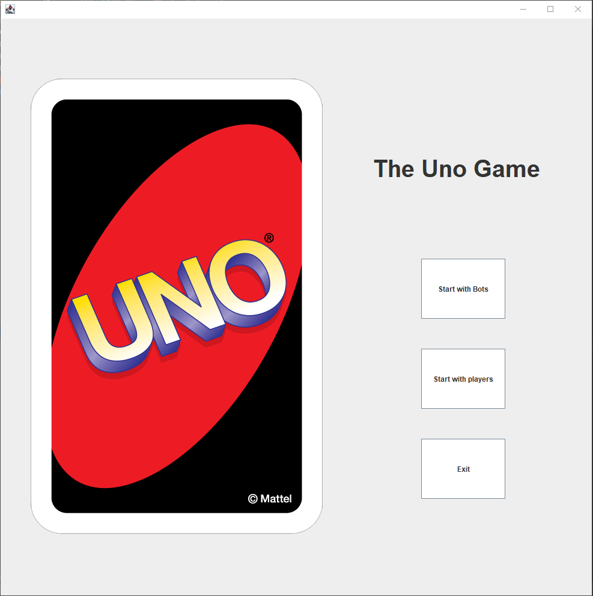
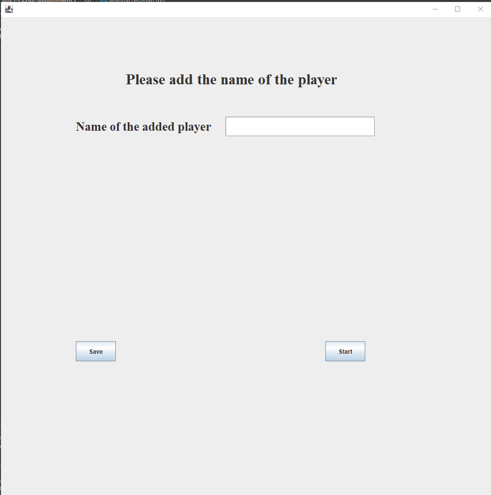
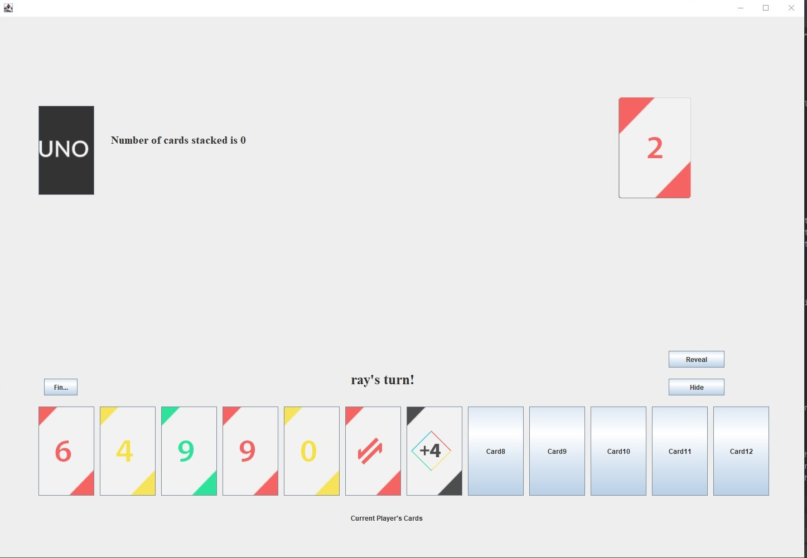
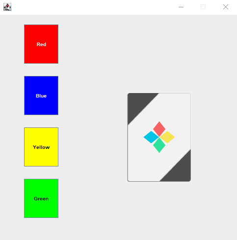
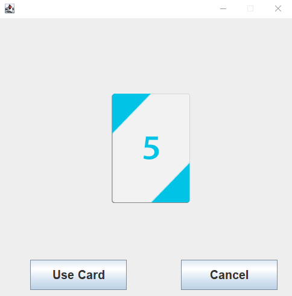
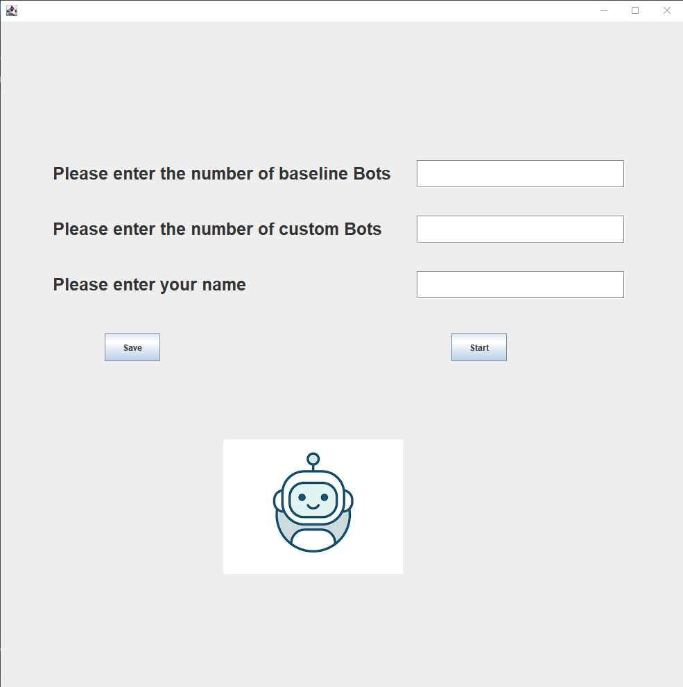
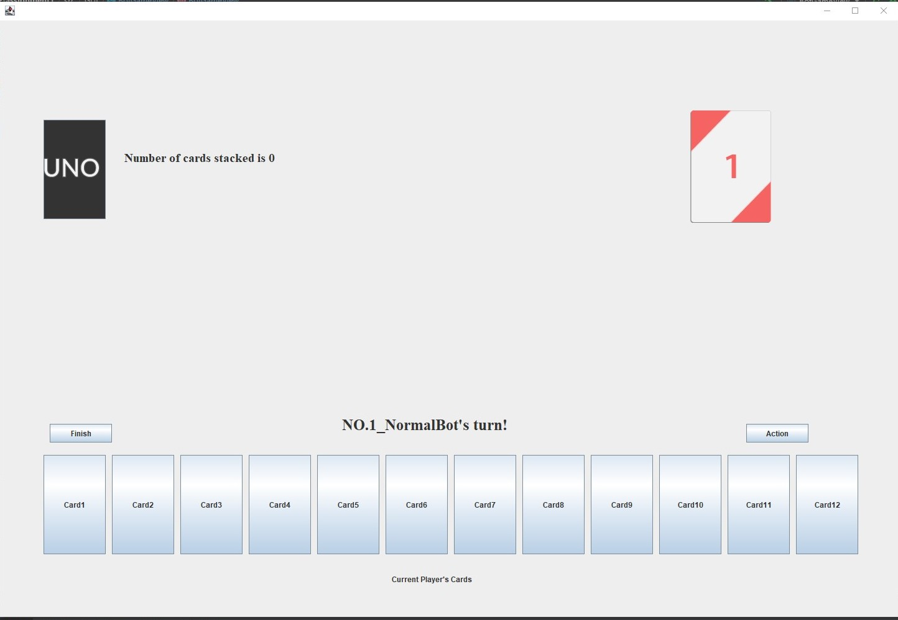
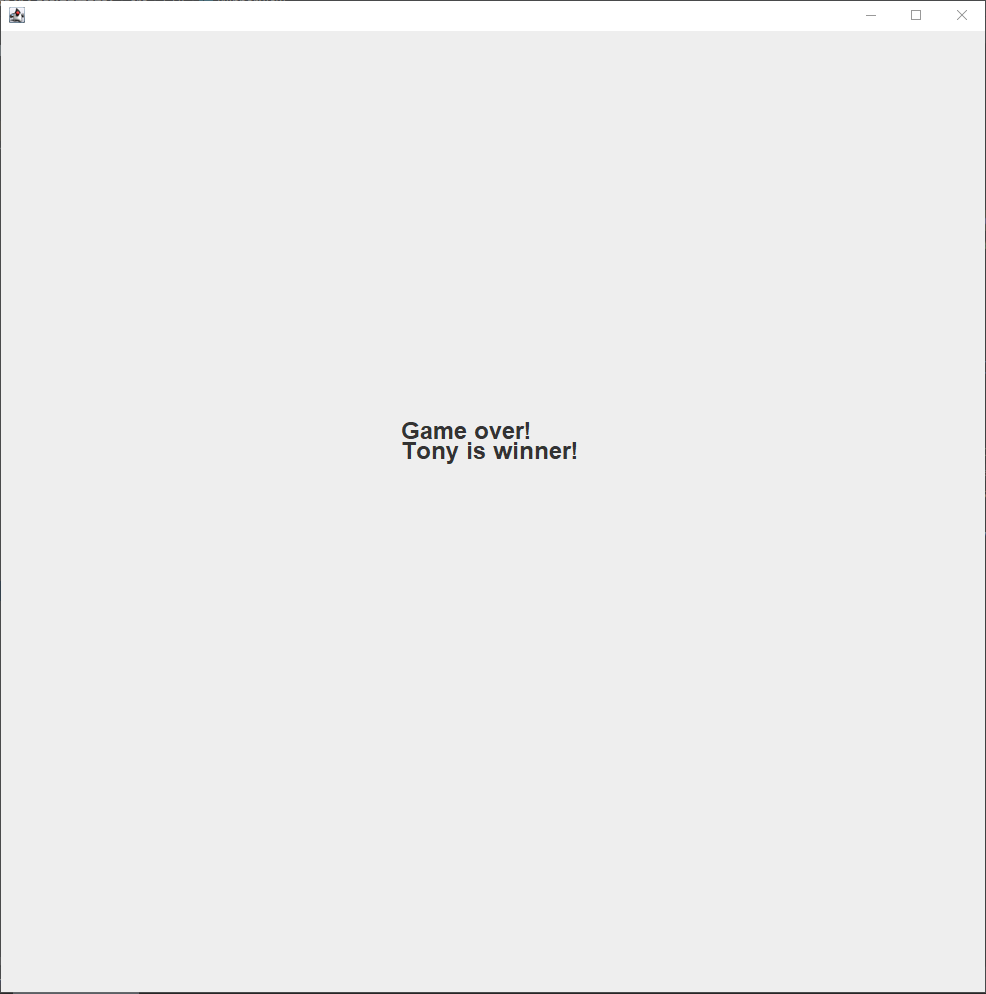

# UnoGame
## Information about this Game
### Time Line :star:
Started from Feb 8, 2021 to Feb 25, 2021. 
### Goal of the game :star: 
The aim of the game is to be the first player to play out all of their own cards. 
### Cards :star:
The deck consists of 108 cards.
* Four “Wild” cards (ones look like color wheels)
* Four “Wild Draw Four” cards
* For each color in red, yellow, green and blue: One “0” card, Two sets of “1” - “9” cards, Two “Skip” cards (ones marked with ∅), Two “Reverse” cards, Two “Draw Two” cards. 

### Rules :star:
* On a player's turn, they have options below to perform:
  * play one card matching the latest card of the discard pile in color, number, or symbol
  * play a Wild card, or a Wild Draw Four card 
  * draw the top card from the deck, then play it if possible
* The played-out card will be the latest card of the discard pile. 
* If all cards are drawn (draw pile is empty), while no player has played all his or her cards, the top card in the discard pile is set aside and the rest of the discard pile is shuffled to create a new deck. Play then proceeds normally.
* The game ends if one player has all of their cards played out.
## Information abou this Project
### Prerequisites :star:
IDE: Intellij IDEA Community Edition 
Project SDK: Java 15 version "15.0.2"
### Environment Setup and configurations :star:
  * You should open and create a new project on Intellij.  
  * Choose the Java 15 as the project SDK. Then create a module and set the src directory to be Sources. If you handle properly, src directory should change to blue. 
  * Navigate to src/Uno/Uno. 
  * Right Click the src/Gui/StartView.java file and click the Run "StartView.main()" button in the middle of the menu that has been popped out to run the GUI.
  * Then the game will starts!
### Operations, Results, and the Error Messages :star:
  There are several frames for this project and Tests should be created based on this four different frames. 
  1. The first frame is the Menu for players to choose if they want to compete with Ai or other players or exit the game. 
     
  * If player choose the start with players, then he will move to the next frame which lets him to enter the all players'names.
  * If player choose the start with bots, then he will move to the next frame which lets him to enter his name and number of normal bots and custom bots.
  * If player choose the exit button, the game will directly over.
  2. The next frame is the frame designed for competing with players where users should enter the number of players. 
     
  * Users should text their names and click the add button to add the players. All the added player names will show on the menu and click the start button, the game will begin.
  * Users should enter the number that is bigger than 2 and smaller than 10 and then click the start button to start the game. Then the game should move to the next menu which is the GameView. 
  * Enter any number that is less than 2 or greater than 10 will cause the game to crash. If you click the start button, the game will not move to the next Game View and an error message will be displayed with "Invalid Output"
  3. The next frame is the main Game View which shows the progress of the game. Current player could see the current game state and decide the action for his turn.  
     
  * Click the Draw button on the top left. A new UnoCard will be added to your cards and the card that has been drawed from drawpile will display at the bottom. 
    * Error: 1. If you have penalty, then you should draw the cards until the penalty decreases to 0. Otherwise, you could not click any button. If you click any button, error message will display. 2. In one round, you could only draw one card. If you draw two card without penalty, error message will occur with "Can not draw extra card!"
  * Click on Hide/Reveal button. The hand cards of the current player should be hided or revealed. 
  * The current game state is on the right top. Try to click on any cards that matches one of the game states(color, content).
      The game should proceed to the next decision frame.. 
    * Error: If player chooses the cards at the bottom that does not match the current game state based on the rules, error messages will display with "Can not play this card!" and ask the player to select another card.
  * When player play out a valid number card(e.g. Yellow 1). The color and number should be updated
    to the Game state with color and content.
  * Click the Skip button will cause the next player to skip his turn.
  * Play out a special card. The current color and content should be updated.
    The special effect of the card should be applied by the followings:
    * Reverse: switch direction
    * Skip: next player is skipped
    * Draw two: The stacked penalty should plus 2, and the next player should draw that number of cards if he/she has no draw two cards.
    * Wild: The set new color panel should be displayed and allow player to click on one of the colors. The current color should be changed accordingly.
    * Wild draw four: The player should be able to change color, and the penalty should plus 4.
    The next play should draw that number of cards if he/she has no wild draw four.
  * Start and play a game until the draw pile is exhausted. If the draw pile number gets to 0 and the game is still not over,
     the most recent drawn card will be updated to the Game State and all the rest cards in the discard pile will be shuffled and put it back to the draw pile. Besides, the discard pile number will be zero.
  4. The next frame is the WildView for the special card Wild and WildF. During the previous frame, if the player chooses to play Wild or WildF card, this frame will pop out.  
  * Player could click the color that they want for the next turn and click the select button to decide their decision. Then game will go back to the second frame. 
    * Error: If the player do not choose the color and click the select button, error message will appear with "Please choose on color!" 
  5. The next frame is the SelectView for selecting any card except the Wild and WildF. 
     
  * The image of the UnoCard chosen by the Player should display in the middle to help the player be sure that he wants tp play this card.
    * Error: 1.If the player plays an invalid card, error message will pops out to remind player that he can not play this card. 
    * Error: 2.If the player tries to play two cards in one round, error message will also pops out to remind player that he can not play several cards in one round.
  6. The next frame is designed for when player want to play with bots instead of other players. Player could start this game by clicking start with bots at the beginning, then the new game will begin and current frame will show up. 
     
  * Player need to enter his name and the number of normal bots and the number of custom bots. 
  * Enter any sum of two number that is less than 2 or greater than 9 will cause the game to crash and the error message will display. If you click the start button, the game will not move to the next BotGameView. 
  7. The corresponding next frame is the BotGameView which shows the progress of the game. Player could see the current game state and decide the action for his turn and player has to clicks action button to help bots finish his turn and see the cards that bots is playing. 
     
  * For the player turn, the operation is basically the same as the GameView. Cards will be displayed in player turn but will be hidden in bots'turn.
  * For the bots' turn, the player need to click the action button once for bots' turn. Based on the attribute of the bots, different actions will be made and specific message will be displayed to remind player what did current bot do in current turn. 
  * For the bots' turn, player could only clicks the action button and finish button to end bots' turn. If player clicks other buttons, corresponding message will appear.
  8. The fourth frame is the Winner View.  
  * Start and play a game until some player has no hand card, then he/she should be the winner and the game will switch to the winner scene.
    The winner's name will be displayed on this scene. 
      